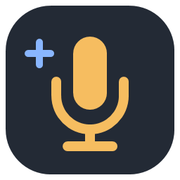

<p align="center"></p>

# MicPilot

Настройка и очистка микрофона для игр, общения и записи. Один обработанный аудиопоток — в Discord, OBS или любое приложение, которое поддерживает выбор микрофона.

**Windows 11 x64 · C# / .NET 10 / WPF · WASAPI · RNNoise**

## Возможности

- Локальное шумоподавление RNNoise, срез низких частот и защита от низкочастотных ударов.
- Четырёхполосный эквалайзер, экспандер, де-эссер, компрессор и выходной лимитер.
- Встроенные и пользовательские профили, импорт и экспорт JSON.
- Анализ записи для подбора стартовых параметров без облака и обучения модели.
- Сравнение «до / после», экспорт WAV и мониторинг ресурсов процесса.

## Как работает

```text
Физический микрофон → MicPilot → виртуальный аудиокабель → игра / Discord / OBS
```

При использовании VB-CABLE выберите **CABLE Input** в MicPilot и **CABLE Output** как микрофон в целевом приложении. Для проверки достаточно локальной записи в OBS; трансляция не нужна. Не захватывайте обработанный и исходный микрофон одновременно.

## Готовая сборка

Тестовые ZIP для Windows 11 x64: [Releases](https://github.com/xChessman-dev/MicPilot/releases). Распакуйте всю папку и запустите `MicPilot.exe`; .NET включён. Инструкции и ограничения: [INSTALL.md](INSTALL.md). RNNoise включён; виртуальный аудиокабель устанавливается отдельно.

## Сборка

Требуются Windows 11, .NET 10 SDK и PowerShell. Для сборки RNNoise — MSVC x64 и Windows SDK. AVX2 требуется для нативного шумоподавителя.

Из x64 Developer PowerShell:

```powershell
./tools/setup-noise.ps1
./tools/build.ps1
./tools/publish.ps1
./tools/run.ps1
```

`setup-noise.ps1` загружает закреплённый исходник RNNoise и проверяет SHA256 весов. Результат хранится в `native/rnnoise` и не включается в Git. Для готовой DLL в другом каталоге задайте `MICPILOT_NATIVE_DIR`. SDK вне PATH можно указать через `DOTNET_ROOT_X64`.

Обычная публикация требует .NET Desktop Runtime 10. `./tools/publish.ps1 -SelfContained` создаёт более крупную автономную папку. Сохраняйте всю папку `release`, а не только EXE.

## Автонастройка

Остановите обработку, запишите фон комнаты, клавиатуру и голос. Анализ показывает предложение; применение выполняется отдельно. Для сравнения «Оригинал» / «С обработкой» обработка должна оставаться остановленной. Записи хранятся в памяти до закрытия приложения.

Автонастройка — акустический анализ, а не обучение нейросети. Клики одновременно с речью могут остаться. Перегруз микрофона и сильные удары воздуха не восстанавливаются полностью: сначала проверьте усиление, расстояние и поп-фильтр.

## Проверки и ограничения

`build.ps1` запускает проверки DSP, профилей, калибровки и форматов. Нативные проверки выполняются при наличии RNNoise. По умолчанию тесты не захватывают микрофон и не отправляют звук в OBS.

Алгоритмическая задержка RNNoise и лимитера — около 25 мс. Это не полная задержка до собеседника. Качество, длительная стабильность и влияние на игру требуют проверки на конкретном ПК. Автозапуск, трей и автоматическое восстановление отключённого устройства пока не реализованы.

## Структура

- `src/MicPilot.Core` — обработка, параметры и анализ.
- `src/MicPilot.App` — интерфейс, WASAPI и профили.
- `tests` — консольные проверки.
- `tools` — сборка и подготовка нативной зависимости.

Пользовательские записи, настройки и модели в репозитории отсутствуют. Лицензии зависимостей перечислены в [THIRD-PARTY-NOTICES.txt](THIRD-PARTY-NOTICES.txt).
